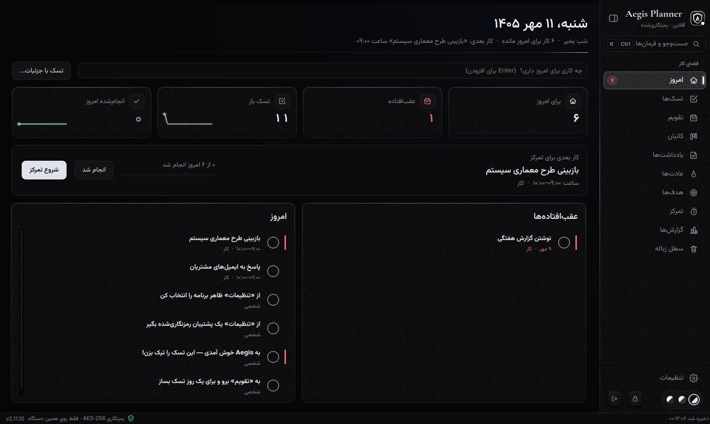
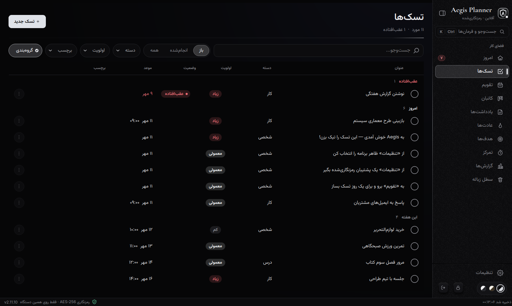
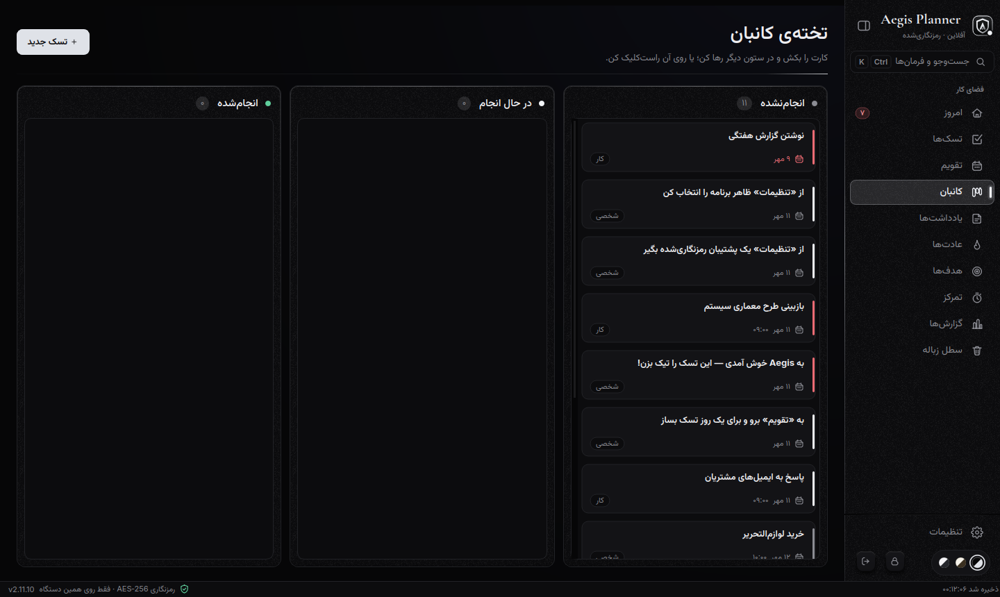
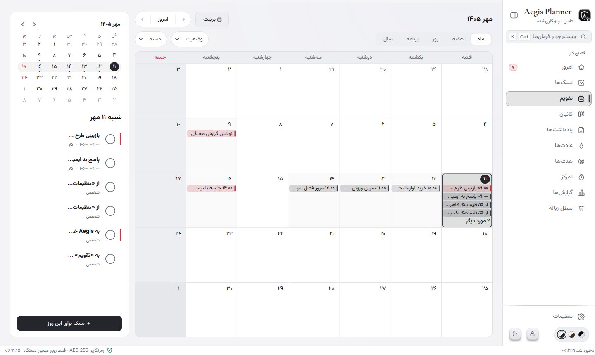
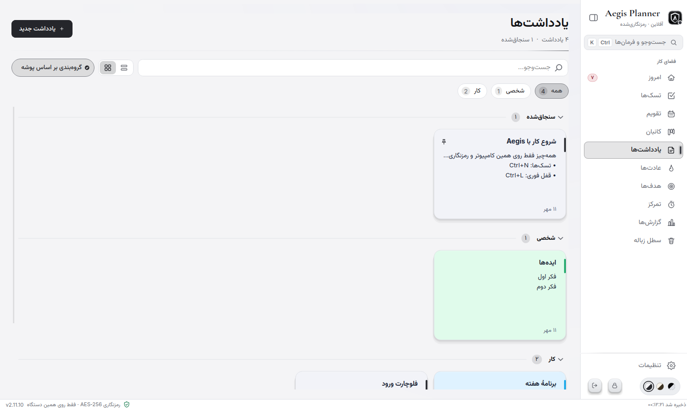
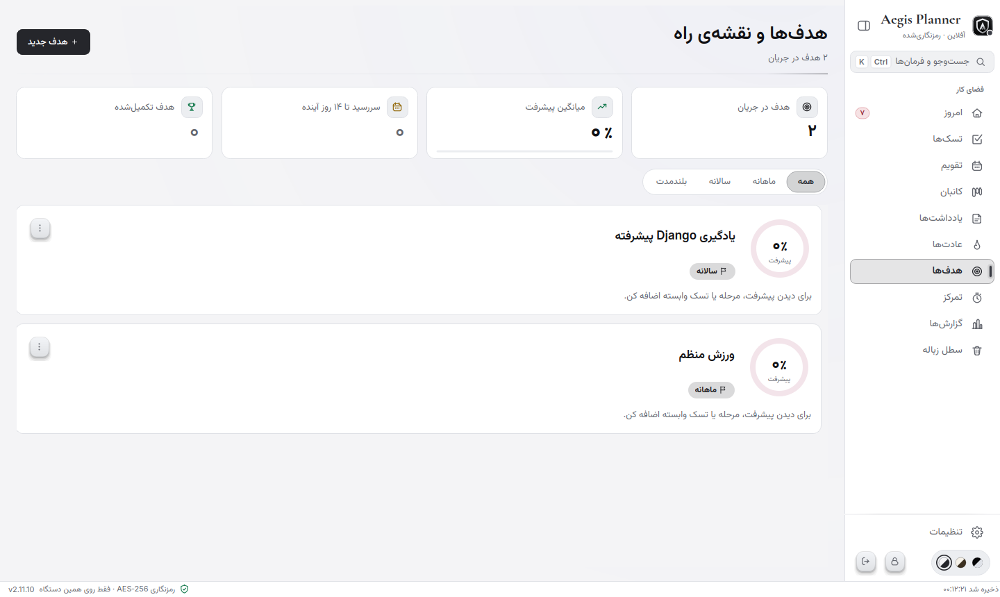
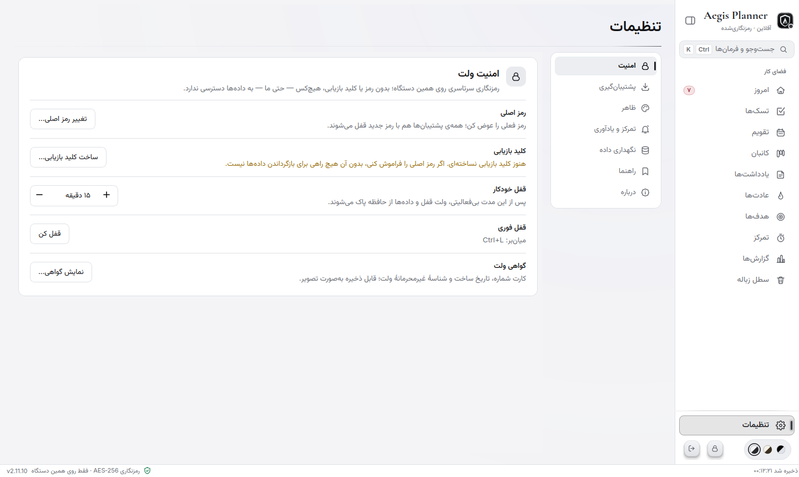

<div align="center">

# Aegis Planner

**An offline, encrypted personal planner for Windows, in Persian (RTL) with a Jalali calendar.**

Tasks · Calendar · Kanban · Notes · Habits · Goals · Focus timer · Reports — all stored in one encrypted file on your own computer.

[English](README.md) · [فارسی](README.fa.md)

[](LICENSE)


</div>



## Why Aegis Planner

- **Private by construction.** No account, no server, no telemetry. Everything lives in one AES‑256‑GCM encrypted file. Without your master password the data is unreadable, even to the application itself.
- **Built for Persian.** Right‑to‑left layout, Jalali (Shamsi) calendar with Saturday‑first weeks, Persian digits, Persian quick‑add (“تسک بساز فردا ساعت ۱۰ جلسه”).
- **Calm and fast.** Sixteen themes (dark and light), keyboard‑first (`Ctrl+K` command palette), smooth with thousands of tasks.
- **Open source.** GPL‑3.0‑or‑later. Read it, audit it, build it yourself.

## Screenshots

| | |
|---|---|
|  |  |
|  |  |
|  |  |

## Features

- **Tasks** — categories, priorities, tags, subtasks, start/end times, multi‑day ranges, daily/weekly repeats, links to goals, undo (`Ctrl+Z`), trash with 30‑day retention.
- **Calendar** — Jalali month, week, day, agenda and year views; draw, move and resize tasks with the mouse; mini‑month; printing to PDF.
- **Kanban**, **Notes** (folders, pinning, rich blocks, Markdown/PDF export), **Habits** (streaks, heat‑map), **Goals** (milestones, progress), **Focus** (Pomodoro), **Reports** (with a PDF report that contains no task text).
- **Quick add** from anywhere in Windows (`Ctrl+Alt+Space`, optional) and from the palette (`Ctrl+K`).
- **Reminders**, auto‑lock, automatic encrypted backups with browse/verify/restore.
- **Import/Export** — encrypted `.aegis` vault, Markdown notes, iCalendar (`.ics`).

## Download and install (Windows 10/11)

1. Open the [**Releases**](https://github.com/sepehrkhasto/aegis-planner/releases/latest) page.
2. Download `AegisPlanner-Setup-<version>.exe` and, optionally, `SHA256SUMS.txt`.
3. Verify the download (see below), then run the installer. You can choose the install folder. Uninstalling never deletes your data unless you explicitly choose to.

Your data is stored in `%APPDATA%\AegisPlanner\` (`vault.aegis`, `backups\`, `prefs.json`, `aegis.log`). Use `AegisPlanner.exe --data-dir "E:\AegisData"` to keep it elsewhere, for example on a USB drive.

### Windows SmartScreen / “Windows protected your PC”

The installer is **not code‑signed**. A code‑signing certificate costs money every year and is not available to everyone, so for a free open‑source project the executable is distributed unsigned. Windows SmartScreen shows a warning for any new, unsigned executable that few people have downloaded yet. On Windows 11, *Smart App Control* can additionally block unsigned programs without a “Run anyway” button; it is on only for clean installs of Windows 11 and can be turned off in *Windows Security → App & browser control*.

This warning does **not** mean the file is malicious; it means “unknown publisher”. You do not have to trust a warning or a developer’s word. You can verify the file yourself:

- **Check the SHA‑256 hash.** Every release publishes the hash of each file in `SHA256SUMS.txt` and in the release notes. In PowerShell:

  ```powershell
  Get-FileHash .\AegisPlanner-Setup-2.11.10.exe -Algorithm SHA256
  ```

  The printed hash must be identical to the one on the release page. If it differs, do not run the file.
- **Check how it was built.** Release files are produced by a public GitHub Actions workflow ([`.github/workflows/release.yml`](.github/workflows/release.yml)) straight from the tagged source code; the build log is public.
- **Build it yourself** from source (below) and compare behaviour, or just run from source.

To continue past SmartScreen: click **More info → Run anyway**.

## Security model

| | |
|---|---|
| Key derivation | PBKDF2‑HMAC‑SHA256, 600,000 iterations, random 16‑byte salt |
| Encryption | AES‑256‑GCM (authenticated). A random 256‑bit data key (DEK) encrypts the vault; the DEK is wrapped by your master password |
| Password change | A new DEK is generated; the vault and every backup are re‑encrypted, so the old password stops working |
| Recovery key | Optional `AEGIS‑XXXXX‑…`, shown once, wraps the DEK independently of the password |
| Storage | Atomic writes (temp file → fsync → rename) plus automatic encrypted backups |
| Network | None by default. Optional, off by default: a once‑a‑day request to the public GitHub API for the latest version number. Nothing about you or your vault is sent |
| Zero knowledge | The master password and keys are never written to disk. **If you forget the password and have no recovery key, the data cannot be recovered by anyone.** |

Read [SECURITY.md](SECURITY.md) for the threat model, limits and how to report a vulnerability.

## Run or build from source

Requires Python 3.10 or newer.

```bash
git clone https://github.com/sepehrkhasto/aegis-planner.git
cd aegis-planner
python -m venv .venv
.venv\Scripts\activate          # Windows;  source .venv/bin/activate on Linux/macOS
pip install -r requirements.txt
python run_aegis.py
```

Build the installer (Windows) with `build_windows.bat`, or follow [docs/BUILD.md](docs/BUILD.md) for the step‑by‑step guide, tests and code signing.

## Tests

```bash
pip install -r requirements-dev.txt
set QT_QPA_PLATFORM=offscreen      # PowerShell: $env:QT_QPA_PLATFORM="offscreen"
python -m pytest tests -q
```

About a thousand tests cover the crypto and vault format, corrupted/hostile vault files, the Jalali calendar, recurrence, every page and dialog across themes and window sizes, and keyboard flows. The `tools/` folder adds a randomised GUI stress test (`chaos_gui.py`), a memory‑leak check and a benchmark.

## Contributing

Bug reports, translations and pull requests are welcome — see [CONTRIBUTING.md](CONTRIBUTING.md) and the [Code of Conduct](CODE_OF_CONDUCT.md).

## License

Aegis Planner is free software under the **GNU General Public License v3.0 or later** ([LICENSE](LICENSE)). It uses PyQt6 (GPL v3) and bundles fonts under the SIL Open Font License; see [THIRD_PARTY_NOTICES.md](THIRD_PARTY_NOTICES.md).
